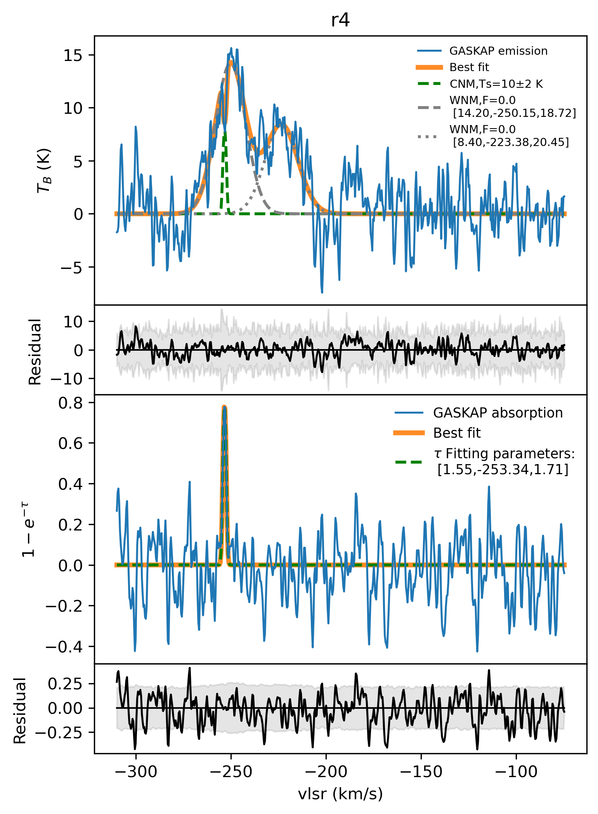

Examples
========

The repository currently includes:

- ``examples/r4.txt`` as a real six-column absorption plus emission spectrum
- ``examples/run_r4_example.py`` to reproduce the legacy four-panel plot
- ``examples/r4_fit.png`` as the saved output from the packaged workflow
- ``examples/r4_csv_outputs/`` with example CSV products

Run the bundled example
-----------------------

.. code-block:: bash

   python examples/run_r4_example.py

This creates:

- ``examples/r4_fit.png``
- ``examples/r4_csv_outputs/Fulldata.csv``
- ``examples/r4_csv_outputs/CNMonlydata.csv``
- ``examples/r4_csv_outputs/WNMonlydata.csv``

Example plot
------------

The upper two panels show the emission spectrum, best-fit model, and emission
residual. The lower two panels show the absorption spectrum in
``1 - exp(-tau)`` form, the absorption fit, and its residual.
